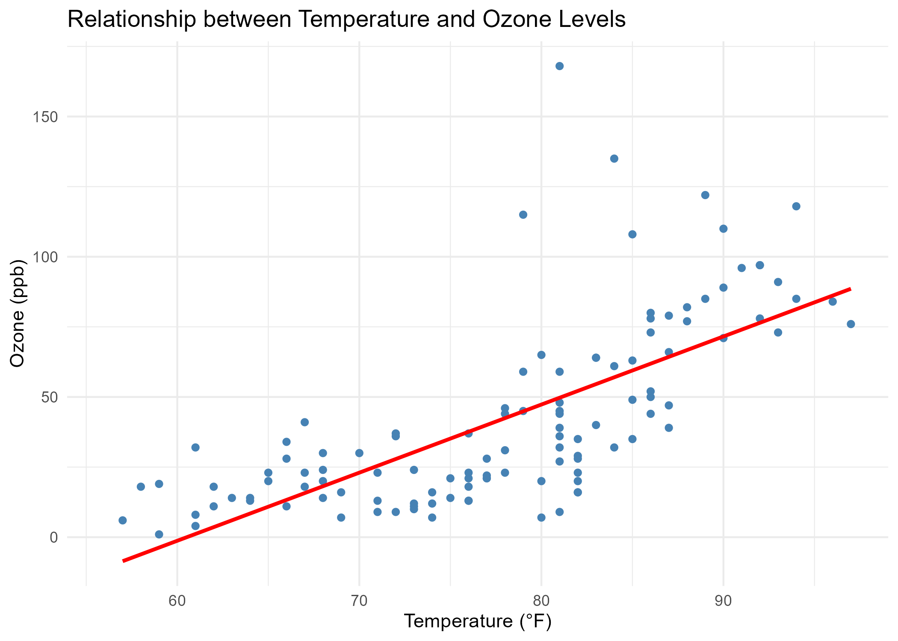

# 🌿 Environmental Data Analysis — Air Quality Study

This project analyzes environmental air quality data using R.  
It focuses on the relationship between **ozone concentration**, **temperature**, **wind speed**, and **solar radiation** to understand air pollution dynamics in New York (1973).

The project demonstrates:
- Data cleaning and preprocessing
- Handling missing values
- Descriptive statistics
- Data visualization with `ggplot2`
- Simple linear regression modeling

---

## 🌍 Dataset

The dataset used is R’s built-in **`airquality`** dataset.  
It contains daily air quality measurements in New York, May–September 1973.

| Variable | Description |
|-----------|--------------|
| Ozone | Ozone concentration (ppb) |
| SolarRadiation | Solar radiation (Langley) |
| Wind | Wind speed (mph) |
| Temperature | Maximum daily temperature (°F) |
| Month | Month of observation |
| Day | Day of observation |

---

## 🧠 Analysis Workflow

1. **Data Loading & Inspection**  
   Loaded the built-in dataset, checked structure, and renamed columns for readability.

2. **Handling Missing Data**  
   Replaced missing Ozone and Solar Radiation values with column means.

3. **Descriptive Statistics**  
   Computed mean, standard deviation, and summaries for key variables.

4. **Data Visualization**  
   - Monthly Ozone levels (boxplot)  
   - Relationship between Temperature and Ozone (scatter plot)  

5. **Modeling**  
   - Built a linear regression model to predict Ozone based on Temperature, Wind, and Solar Radiation.  
   - Evaluated model fit with correlation between predicted and actual Ozone levels.

---

## 📊 Visualizations

### Ozone Levels by Month


### Relationship Between Temperature and Ozone


---

## 🧰 Tools and Libraries

- **R (v4.5.0+)**
- **tidyverse** (data cleaning & visualization)
- **ggplot2**
- **dplyr**
- **caret**

---

## 📂 Project Structure


---

## 📈 Key Findings

- Higher temperatures are generally associated with increased ozone concentration.  
- Summer months (July–August) showed the highest ozone levels.  
- Wind speed had an inverse relationship with ozone — higher wind reduced ozone accumulation.

---

## 👨‍💻 Author

**Baraka Mitigoa**  
*Graduate Student in Computing & Information Systems*  
*Aspiring Data Scientist*  
[GitHub: @bmitigoa](https://github.com/bmitigoa)

---

## 🏁 How to Run

To reproduce the analysis:

```r
# 1. Open environmental_analysis.R in RStudio
# 2. Run all the code blocks
# 3. View the plots in the "Plots" tab


